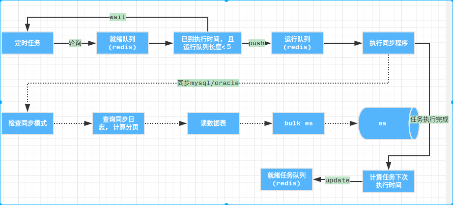

# 火眼数据中心v1

#  接口规范

1. 接口返回的**code**可选值有*0*或*1*, 0表示按预期正常返回, 1则表示接口执行异常,异常信息可在*msg*中查看
2. 接口返回的状态码有：
  - 200: 服务端已接收请求并执行, 结果在返回值中查看;
  - 201: POST 同步请求完成，或者PUT同步创建一个新的资源;
  - 400: 请求参数错误;
  - 500: 服务端异常;

# 目录

**1. [索引管理](#1索引管理)**
  
  - [连接ES](#10连接es未使用)
  - [查看ES索引列表](#12查看es索引列表)
  - [新建ES索引](#13新建es索引)
  - [删除索引](#14删除索引)
  - [检查索引是否存在](#15检查索引是否存在)
  - [查看mapping定义](#16查看mapping定义)
  
**2. [数据管理](#2数据管理)**

  - [csv文件导入](#21csv文件导入)

    - [上传csv](#211上传csv)
    - [新增索引并导入](#212新增索引并导入)
    - [追加csv数据](#213追加csv数据)

  - [数据表导入](#22数据表导入)
    
    - **一.[mysql](#mysql)**

    - [连接数据库](#221连接数据库)
    - [查看数据表列表](#222查看数据表列表)
    - [查看数据表结构](#223查看数据表结构)

    - **二.[oracle](#oracle)**

**3. [数据同步定时任务](#3数据同步定时任务)**

  - [创建定时任务](#31创建定时任务)
  - [查看任务列表](#32查看任务列表)
  - [删除任务](#33删除任务)
  - [暂停任务](#34暂停任务)
  - [恢复任务](#35恢复任务)
  - [手动执行](#36手动执行任务)
  - [任务日志](#37任务日志)

**4. [可视化分享](#4可视化分享)**

  - [可视化列表](#41可视化列表)
  - [创建分享页](#42创建分享页)
  - [编辑分享页](#43编辑分享页)
  - [删除分享页](#44删除分享页)


# 1索引管理

 开发环境使用*Elasticsearch v5.4.3*, 索引管理实现功能有查看es中索引, 索引的创建与删除, 支持导入数据时创建索引(根据csv头部, 数据表字段定义mapping), 同时提供清空索引数据的操作

## 1.0连接ES(未使用)

- method: post
- url: domain/api/v1/elastic

- body 

``` js
{
  "host": "ip",
  "port": 9200
}
```

-　参数说明

| name | type | required | desc |
|:----:|:----:|:-----:|:---:|
| host | string| Y  | ES ip地址 |
| port | number | Y | 连接端口(默认9200) |

- return 

``` js
{
  "code": 0,
  "error": {
    "msg": ""
  },
  "data": {
    "token": ""
  }
}
```

-　错误码说明

| code | msg | 
|:----:|:----:|
| 0 | 正常返回 | 
| 1 | 连接失败, 请检查host或port是否正确 |

## 1.2查看ES索引列表

- method: get
- url: domain/api/v1/elastic/indices

- return

``` js
{
  "code": 0,
  "error": {
    "msg": ""
  },
  "data": [
    {
      "name": "dianli_order_all", # 索引名称
      "docs": "444583",           # 文档数
      "size": "3.7gb"             # 使用磁盘空间大小
    },
  ]
}
```

## 1.3新建ES索引

- method: post
- url: domain/api/v1/elastic/indices

- body 

``` js
{
  "name": "", # 索引名称
  "mapping": {} # mapping对象,
}
```

-　参数说明

| name | type | required | desc |
|:----:|:----:|:-----:|:---:|
| name | string| Y  | 索引名称 |
| mapping | object | Y | 索引mapping属性定义 |

- return 

``` js
{
  "code": 0, # 1: 同名索引已存在或是参数错误
  "error": {
    "msg": ""
  }
}
```

-　错误码说明

| code | msg | 
|:----:|:----:|
| 0 | 正常返回 | 
| 1 | 返回的消息有: 1.同名索引已存在; 2.mapping解析异常 |

**说明**

mapping 的格式如下:

``` js
{
  "mappings": {
    "tyep_name": {
      "properties": {
        "date": {
          "type": "date",
          "format": "yyyy-MM-dd'T'HH:mm:ss.SSSZ||epoch_millis"
        },
        "name": {
          "type": "string"
        },
        "tweet": {
          "type": "string"
        },
        "user_id": {
          "type": "long"
        }
      }
    }
  }
}
```

**注意:**

- *前端提交时仅需提供**properties**对象, 若是通过csv导入或数据表数据同步时创建的索引, 则会检查mapping是否与csv头部或表字段匹配*

- [关于mapping](https://www.elastic.co/guide/en/elasticsearch/reference/current/indices-create-index.html#mappings)

## 1.4删除索引

- method: delete
- url: domain/api/v1/elastic/indices

- body 

``` js
{
  "name": ""
}
```

-　参数说明

| name | type | required | desc |
|:----:|:----:|:-----:|:---:|
| name |string| Y     | 索引名称 |

- return 

``` js
{
  "code": 0,
  "error": {
    "msg": ""
  }
}
```

-　错误码说明

| code | msg | 
|:----:|:----:|
| 0 | 正常返回 | 
| 1 | 未找到该索引 |


## 1.5检查索引是否存在

- method: get
- url: domain/api/v1/elastic/indices/:name

- name: 索引名称

- return

``` js
{
  "code":1,
  "error":{
    "msg":"同名索引已存在"
  }
}
```

## 1.6查看mapping定义

- method: get
- url: domain/api/v1/elastic/indices/mapping/:name

- name: 索引名称

- return

``` js
{
  "code": 0,
  "error": {
    "msg": ""
  },
  "data": {
    "mapping": [      
      {"fild_name": "float"}
    ]
  }
}
```

# 2数据管理

实现功能: 

- 查询es数据
- csv文件数据, mysql/oracle中数据表数据导入es


##  2.1csv文件导入

将用户上传的csv文件数据导入ES, csv导入包括两种方式:

- 索引不存在, 导入过程中根据csv头部创建索引并将数据导入

- 索引已存在, 将csv数据导入该索引

### 2.1.1上传csv

- method: post
- url: domain/api/v1/upload/csv

- body 

*form file field*

- return 

``` js
{
  "code": 0,
  "error": {
    "msg": ""
  },
  "data": {
     "header": [], # csv 头部
     "file": ""    # csv文件路径
  }
}
```

**csv文件格式**
  - 逗号分隔
  - utf8字符编码
  - 文件大小限制1G内

**注意:**

- 1如果mapping中包含geo_point类型的字段，则csv数据格式为"纬度,经度", 如下location表示地理坐标

``` bash
"id","location","city"
1,"22.56,112.57","广州"
```

- 2如果mapping中包含date类型的字段，则csv数据中支持的时间格式有YYYY-MM-DD, YYYY-MM-DD HH:mm:ss, YYYY/MM/DD, YYYY/MM/DD HH:mm:ss四种

### 2.1.2新增索引并导入

- method: post
- url: domain/api/v1/elastic/indices/import

- body 

``` js
{
  "name": "test",
	"mapping": {
		"payment": {
      "type": "keyword"
    },
    "payment_day": {
      "type": "integer"
    }
	},
	"file": "/var/www/code/csv/test.csv"
}
```

-　参数说明

| name | type | required | desc |
|:----:|:----:|:-----:|:---:|
| name | string| Y  | 索引名称 |
| mapping | object | Y  | mapping定义 |
| file | string | Y  | 待导入的csv文件路径 |

- return 

``` js
{
  "code": 0,
  "error": {
    "msg": ""
  }
}
```

-　错误码说明

| code | msg | 
|:----:|:----:|
| 0 | 正常返回 | 
| 1 | 1.该索引已存在; 2.mapping解析错误; 3.文件不存在|

### 2.1.3追加csv数据

- method: post
- url: domain/api/v1/elastic/indices/append

- body 

``` js
{
  "name": "test",
	"file": "/var/www/code/csv/test.csv"
}
```

- return 

``` js
{
  "code": 0,
  "error": {
    "msg": ""
  }
}
```

## 2.2数据表导入

### mysql

#### 2.2.1连接数据库

- method: post
- url: domain/api/v1/mysql/ping

- 查询体

``` js
{
  "host": "",
  "port": "",
  "user": "",
  "passwd": "",
  "database": "",
}
```

-　参数说明

| name | type | required | desc |
|:----:|:----:|:-----:|:---:|
| host | string| Y  | 主机地址 |
| port | string | Y  | 端口 |
| user | string | Y  | 用户名 |
| passwd | string | Y  | 密码 |
| database | string | Y  | 数据库名 |


- return 

``` js
{
  "code": 0,
    "error": {"msg": ""},
    "data": {
      "uuid": "" # 数据库连接标识
  }
}
```

#### 2.2.2查看数据表列表

- method: get
- url: domain/api/v1/mysql/table/:uuid

**参数说明:**
- uuid: **2.2.1连接数据库**返回的连接标识

- return 

``` js
{
  "code": 0,
    "error": {"msg": ""},
    "data": []
}
```

#### 2.2.3查看数据表结构

- method: get
- url: doamin/api/v1/mysql/table/info/:uuid?query={body}

- body

- uuid: **数据库连接测试** 接口返回的uuid

``` js
{
  "name": "表名称"
}
```

- result

``` js
{
  "code": 0,
  "error": {
    "msg": ""
  },
  "data": [
    {
      "Field": "id",
      "Type": "int(11)",
      "Null": "NO",
      "Key": "PRI",
      "Default": null,
      "Extra": "auto_increment"
    }
  ]
}
```

### oracle


# 3数据同步定时任务

定时任务是指用户创建一个数据同步任务, 系统根据任务执行周期定时将mysql/oracle数据同步至es索引. 单个任务的基本信息有目标索引, 数据源表(需提供对该表有select权限的账户), 执行周期, 首次执行时间及同步模式; 任务状态可变更, 如暂停, 恢复执行或者是手动执行(按当前时间从新计算任务执行时间)


- **任务设计思路**


- 由redis维护两个sorted set集合, 分别为就绪任务(ready)及正在运行的任务(running), 任务执行时间的毫秒值作为score;若有同步任务被添加则加入ready队列,系统通过定时器遍历ready队列, 当socre小于当前时间的毫秒值, 则说明该任务已到执行时间, 加入running队列(running队列的最大长度5, 若当前正在运行的同步任务已达到5个, 则需要等待), 同步任务执行完毕后会计算下次执行时间,　并加入ready队列

- 执行同步任务会记录本次已同步到数据表的哪一行, 下次任务执行时通过查询任务日志及数据表当前数据量计算出本次需同步的数据总数, 若同步方式为全量, 则每次同步都会将数据数据完整同步至es


## 3.1创建定时任务

- method: post
- url: domain/api/v1/schedule/task

- body 

``` js
{
  "key": "389bb754fcdd230e370fc6917485c687",
  "index": "insight_dc",
  "primary": "id",
  "mapping": {"id": {"type":"keyword"}, "name": {"type": "keyword"}},
  "table": "pintu",
  "unit": 4,
  "interval": 1,
  "runTime": "2018-08-17 15:00:00",
  "status": 1,
  "sync_model": 1
}
```

- 参数说明

| name | type | required | desc |
|:----:|:----:|:-----:|:---:|
| key | string| Y  | 数据库连接标识,**2.2.1连接数据库**返回 |
| index | string | Y  | 索引名称 |
| primary | string | N  | 文档_id主键, primary应使用与table主键相同的字段, 若不指定主键则由es随机生成_id |
| mapping | object | Y  | mapping, 不能为空 |
| table | string | Y  | 数据表名 |
| unit | number | Y  | 最小执行单位,取值1-6分别表示秒,分,时,天,周,月 |
| interval | number | Y  | 执行周期 |
| runTime | string | Y  | 任务首次运行时间不小于当前时间, 格式 **YYYY-MM-DD HH:mm:ss** |
| status | number | Y  | 任务状态(ready: 1, running: 2, pause: 3, close: 4, error: 5) |
| sync_model | number | Y  | 同步模式 1:增量, 2:全量 |

- return

``` js
{
  "code": 0,
  "error": {
    "msg": ""
  }
}
```

**code 说明**

| code | desc |
|:----:|:----:|
| 1    |对应的情况有: 1.数据库登录过期; 2.mapping字段

## 3.2查看任务列表

- method: get
- url: domain/api/v1/schedule/task?query={body}

- body 

``` js
{
  "offset": 0,
  "limit": 8,
  "where": {
    "index": "", # 索引名
    "status": ""   # 任务状态
  }
}
```

- return

``` js
{
  "code": 0,
  "error": {
    "msg": ""
  },
  "data": []
}
```

## 3.3删除任务

- method: delete
- url: domain/api/v1/schedule/task/:id

- return

``` js
{
  "code": 0,
  "error": {
    "msg": ""
  }
}
```

-　错误码说明

| code | msg | 
|:----:|:----:|
| 0 | 正常返回 | 
| 1 | 任务不存在或任务正在执行 |

## 3.4暂停任务

- method: post
- url: domain/api/v1/schedule/task/pause

- body 

``` js
{
  "uuid": "任务uuid"
}
```

- return

``` js
{
  "code": 0,
  "error": {
    "msg": ""
  }
}
```

## 3.5恢复任务

- method: post
- url: domain/api/v1/schedule/task/recover

- body 

``` js
{
  "uuid": "任务uuid"
}
```

- return

``` js
{
  "code": 0,
  "error": {
    "msg": ""
  }
}
```

## 3.6手动执行任务

- method: get
- url: domain/api/v1/task/run/:uuid

- uuid: 任务uuid

- return

``` js
{
  "code": 0,
  "error": {
    "msg": ""
  }
}
```

-　错误码说明

| code | msg | 
|:----:|:----:|
| 0 | 正常返回 | 
| 1 | 任务不存在或任务已暂停|

##　3.7任务日志

- method: get
- url: domain/api/v1/task/log/:uuid

- return 

```js
{
  "code": 0,
  "error": {
      "msg": ""
  },
  "data": [
    {
        "created_at": "2018-08-28 16:05:02",
        "updated_at": "2018-08-28 16:05:05",
        "id": 37,
        "uuid": "ede437ab24709204ed415655ea98444c",
        "offset": 0,
        "sync": 3215,
        "status": "done",
        "msg": "执行成功, 本次共同步3215条数据",
        "deleted_at": "1999-12-31T16:00:00.000Z"
    }
  ],
  "total": 1
}
```

# 4可视化分享

## 4.1可视化列表

method: get
url: /api/v1/visual?query={body}

- body

``` js
{
  "offset": 0,
  "limit": 8,
  "where": {
    "name": "",
    "created_at": {
      "gte": "2017-02-02",
      "lte": "2017-02-10"
    },
    "updated_at": {
      "gte": "",
      "lte": ""
    }
  }
}
```

- return 

``` js
{
    "code": 0,
    "errors": {
      "msg": ""
    },
    "total": 3,
    "data": []
}
```

## 4.2创建分享页

- method: post
- url: /api/v1/visual

- body

``` js
{
  "name": "测试一下",
  "schema": {},
  "link": "baidu.com",
  "uuid": ""
}
```

- return 

``` js
{
  "code": 0, 
  "errors": {
    "msg": ""
  }
}
```

## 4.3编辑分享页

- method: put
- url: /api/v1/visual/:id

- body

``` js
{
  "name": "测试一下",
  "schema": {},
}
```

- return 

``` js
{
    "code": 0, 
    "errors": {
      "msg": ""
    }
}
```

## 4.4删除分享页

- method: delete
- url: /api/v1/visual/:id

- return 

``` js
{
  "code": 0, 
  "errors": {
    "msg": ""
  }
}
```